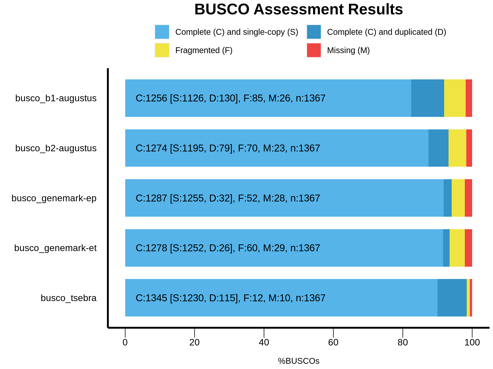
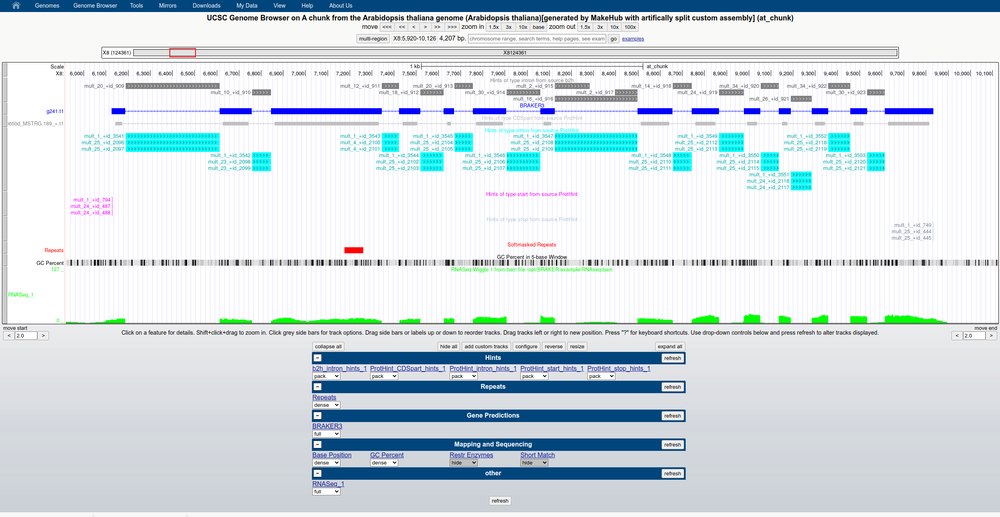

# Hands-on BRAKER3 Genome Annotation Tutorial

Materials for the BRAKER3 workshop within BGAcademy23 by Katharina Hoff (katharina.hoff@uni-greifswald.de).

Please find slides for an introductory talk on genome annotation (with BRAKER and TSEBRA) at [slides_bga_2023.pdf](slides_bga_2023.pdf).

In the following, we will walk through the process of genome annotation with BRAKER3 on the example of a small proportion of the *Arabidopsis thaliana* genome.

## Repeat masking

Repetitive sequences are a huge problem for genome annotation. Some repeats only coincidentally look like protein-coding genes, others (such as transposases) are protein-coding genes, but we usually are not interested in any of these "repeat genes" when trying to find protein-coding genes in a novel genome. Thus, a genome should be repeat-masked prior gene prediction. 

Repeat masking is a resource and time-consuming step that is out of scope for this workshop. We recommend using RepeatModeler2 ([paper](https://doi.org/10.1073/pnas.1921046117), [software](https://www.repeatmasker.org/RepeatModeler/) ) to construct a species-specific repeat library and mask the genome with RepeatMasker (ideally, you will perform these computations on a node with >70 threads, in a place with very fast storage i/o, possibly using RAM instead of actual hard drive as a temporary file storage place):

```
T=72 # you need a large number of threads and fast i/o storage
GENOME=/opt/BRAKER/example/genome.fa
DB=some_db_name_that_fits_to_species

BuildDatabase -name ${DB} ${GENOME}
RepeatModeler -database ${DB} -pa ${T} -LTRStruct
RepeatMasker -pa 72 -lib ${DB}-families.fa -xsmall ${GENOME}
```

This results in a file `${GENOME}.masked`. 

<details>
  <summary><b>Click to learn how to mask more rigorously when needed</b></summary>
Depending on the kind of genome, plenty of unmasked repeats may still persist. This is generally an issue to be expected in large genomes, such as vertebrate genomes, and you will notice the problem if the count of predicted proteins is extremely high. You can try to overcome "under-masking" with the following steps (we are suggesting to use GNU parallel to speed up the process):

```
splitMfasta.pl --minsize=25000000 ${GENOME}.masked

# Running TRF
ls genome.split.*.fa | parallel 'trf {} 2 7 7 80 10 50 500 -d -m -h'

# Parsing TRF output
# The script parseTrfOutput.py is from https://github.com/gatech-genemark/BRAKER2-exp
ls genome.split.*.fa.2.7.7.80.10.50.500.dat | parallel 'parseTrfOutput.py {} --minCopies 1 --statistics {}.STATS > {}.raw.gff 2> {}.parsedLog'

# Sorting parsed output..."
ls genome.split.*.fa.2.7.7.80.10.50.500.dat.raw.gff | parallel 'sort -k1,1 -k4,4n -k5,5n {} > {}.sorted 2> {}.sortLog'

# Merging gff...
FILES=genome.split.*.fa.2.7.7.80.10.50.500.dat.raw.gff.sorted
for f in $FILES
do
    bedtools merge -i $f | awk 'BEGIN{OFS="\t"} {print $1,"trf","repeat",$2+1,$3,".",".",".","."}' > $f.merged.gff 2> $f.bedtools_merge.log
done

# Masking FASTA chunk
ls genome.split.*.fa | parallel 'bedtools maskfasta -fi {} -bed {}.2.7.7.80.10.50.500.dat.raw.gff.sorted.merged.gff -fo {}.combined.masked -soft &> {}.bedools_mask.log'

# Concatenate split genome
cat genome.split.*.fa.combined.masked > genome.fa.combined.masked
```

The file `genome.fa.combined.masked` will be more rigorously masked.
</details>

## RNA-Seq alignment with HiSat2

Spliced alignments of RNA-Seq short reads are a valuable information source for predicting protein-coding genes with high accuracy. BRAKER3 can in fact handle the alignment step for you (it will execute Hisat2). However, this is a time-consuming step, and we will skip it here.

Executing HiSat2 is out of scope for the current session. You find a readily prepared alignment file in [/opt/BRAKER/example/RNAseq.bam](/opt/BRAKER/example/RNAseq.bam). It is possible to feed BRAKER3 the precomputed BAM format alignment file instead of the raw RNA-Seq reads. This is what we will do here.

<details>
  <summary><b>If you want to see how such a file was prepared, click here and read.</b></summary>
  
We will map the *Arabidopsis thaliana* Illumina RNA-Seq reads from library SRR934391 in files [SRR934391_1.fastq.gz](/home/genomics/workshop_materials/genome_annotation/sra/SRR934391_1.fastq.gz) and [SRR934391_2.fastq.gz](/home/genomics/workshop_materials/genome_annotation/sra/SRR934391_2.fastq.gz). These are paired-end data, i.e. one file contains the forward reads while the other contains in the same order the reverse reads. The length of reads is in this case 100 nt.

We will use HiSat2 ([publication](https://doi.org/10.1038/s41587-019-0201-4), [software](https://github.com/DaehwanKimLab/hisat2)) to align these reads against a chunk of the *Arabidopsis thaliana* genome contained in the file [genome.fa](genome.fa). (You can in principle use any alignment tool capable of aligning RNA-seq reads to a genome, as long as it can perform spliced alignment.)

First, we need to build an index from the genome file:

```
# building the hisat2 index
hisat2-build /opt/BRAKER/example/genome.fa genome-idx 1> hisat2-build.log 2> hisat2-build.err
```

Inspect the log files [hisat2-build.log](hisat2-build.log) and [hisat2-build.err](hisat2-build.err) for possible errors.

Next, we align the RNA-seq reads against the genome. Consider to **not** do this on the free GitPod resources. Performing this alignment took about 7 minutes with 70 threads. The precomputed output file is provided at `/home/genomics/workshop_materials/genome_annotation/sra/SRR934391.sam`, and we will continue to use that pre-computed file.

```
T=8 # adjust to number of threads that you booted with

wget ftp://ftp.sra.ebi.ac.uk/vol1/fastq/SRR934/SRR934391/SRR934391_1.fastq.gz
wget ftp://ftp.sra.ebi.ac.uk/vol1/fastq/SRR934/SRR934391/SRR934391_2.fastq.gz

RNASEQDIR=.

time hisat2 -p ${T} -q -x genome-idx -1 ${RNASEQDIR}/SRR934391_1.fastq.gz \
    -2 ${RNASEQDIR}/SRR934391_2.fastq.gz -S rnaseq.sam \
    1> hisat2-align.log 2> hisat2-align.err
```

Careful, above bam file is just an demo example! We will be using a different bam file for running BRAKER because the above BAM file does not contain sufficient data for running BRAKER3, successfully!
</details>

## Annotation of protein coding genes

Structural genome annotation is ideally performed by a combination of a statistical model (e.g. Hidden Markov Model derivate) and extrinsic evidence (e.g. from transcriptomics or known protein sequences). The statistical model parameters have to be adapted to the genomic properties of novel species. For adapting parameters, an initial set of high-quality training genes from the target species is required. This is tricky to obtain. BRAKER is a perl script that comprises several pipelines to automated the solution of this problem: fully automatically generate an initial set of training genes, train gene finders, and then predict genes with the trained parameters and extrinsic evidence.

We will today take an approach to structural genome annotation that takes advantage both of RNA-Seq data, and a large database of known proteins, using BRAKER3 ([preprint](https://doi.org/10.1101/2023.06.10.544449), [software](https://github.com/Gaius-Augustus/BRAKER)). If sufficient transcriptome data is available, then BRAKER3 is usually the best choice of pipeline. However, in the lack of transcriptome data, you may consider alternative BRAKER pipelines that we do not cover, today (e.g. running BRAKER1 with RNA-Seq ([paper](https://doi.org/10.1093/bioinformatics/btv661)) + running BRAKER2 with protein database only ([paper](https://doi.org/10.1093/nargab/lqaa108)) followed by combination with TSEBRA ([paper](https://doi.org/10.1186/s12859-021-04482-0), [software](https://github.com/Gaius-Augustus/TSEBRA)); or in complete lack of RNA-Seq data, running BRAKER2 with proteins only on small genome, or running GALBA ([paper](https://doi.org/10.1186/s12859-023-05449-z)) with proteins of a few reference species on a large genome).

### BRAKER3

BRAKER3 uses spliced aligned RNA-Seq data from Hisat2 ([paper](https://www.nature.com/articles/s41587-019-0201-4), [software](https://github.com/DaehwanKimLab/hisat2)) for genome-guided transcriptome assembly with Stringtie ([paper](https://www.nature.com/articles/nbt.3122), [software](https://github.com/gpertea/stringtie)). GeneMarkS-T ([paper](https://academic.oup.com/nar/article/43/12/e78/2902598), [software](http://exon.gatech.edu/genemark/license_download.cgi)) is used to call protein coding genes in the transcripts. These transcripts are "noisy", therefore, a large database of proteins (e.g. an OrthoDB partition) is used to filter these predictions, using among other GeneMark-specific scripts including ProtHint ([software](https://github.com/gatech-genemark/ProtHint)) with Spaln ([paper](https://academic.oup.com/bioinformatics/article/24/21/2438/191484), [software](https://github.com/ogotoh/spaln)) the fast search tool DIAMOND ([paper](https://www.nature.com/articles/s41592-021-01101-x), [software](https://github.com/bbuchfink/diamond)). Both, the transcriptome and protein evidence is then used by GeneMark-ETP ([preprint](https://www.biorxiv.org/content/10.1101/2023.01.13.524024v1), [software](https://github.com/gatech-genemark/GeneMark-ETP)) for self-training this HMM-based gene finder. This generates a training set for AUGUSTUS ([paper](https://doi.org/10.1093/bioinformatics/btn013), [software](https://github.com/Gaius-Augustus/Augustus)). Both, the GeneMark-ETP, and the AUGUSTUS gene set incorporate the evidence to some extent, and these gene sets are merged with TSEBRA by BRAKER3.

Training AUGUSTUS for a novel species usually comprises a step called etraining that adapts species-specific parameters of the statistical model of AUGUSTUS, and a step called optimize_augustus.pl that optimizes meta-parameters of that model. optimize_augustus.pl is very time-consuming, it yields usually ~2 percent points of accuracy on gene level. For this session, will disable this step with --skipOptimize. If you ever want to annotate a real new genome, make sure to delete `--skipOptimize` from your BRAKER calls (and expect substantially longer runtime). Also, GeneMark-ETP usually has a longer runtime. We will here set the maximal intergenic region for GeneMark-ETP to 10000. Please never apply this setting to a real genome annotation task, and expect a larger runtime.

<span style="color:red">**This is the code that we execute in GitPod, today:**</span>.


```
T=8 # adjust to number of threads that you booted with, takes ~30 minutes with 4 threads

# delete output from a possible previous run if it exists
if [ -d BRAKER3 ]
then
    rm -rf BRAKER3
fi

ORTHODB=/workspace/odb/Viridiplantae.fa # adjust to suitable clade

# run BRAKER3
time braker.pl --workingdir=BRAKER3 --genome=/opt/BRAKER/example/genome.fa --bam=/opt/BRAKER/example/RNAseq.bam \
    --prot_seq=${ORTHODB} --AUGUSTUS_BIN_PATH=/usr/bin/ \
    --AUGUSTUS_SCRIPTS_PATH=/usr/share/augustus/scripts/ --threads ${T} \
    --gm_max_intergenic 10000 --skipOptimize # remember to remove both these options for real jobs!
    # this call takes a few minutes even with --skipOptimize and --gm_max_intergenic 10000
```

This job takes a long time compute, even though it is a toy data set. While it's computing, we can inspect pre-computed results of the same job in the directory `BRAKER3_precomputed_results`.


Let's inspect the output, the most important files are braker.gtf, Augustus/augustus.hints.gtf, and GeneMark-ETP/genemark.gtf:


```
cd BRAKER3_precomputed_results
ls -lh braker.gtf Augustus/augustus.hints.gtf GeneMark-ETP/genemark.gtf
```

The file [BRAKER3/what-to-cite.txt](BRAKER3/what-to-cite.txt) advises you on what papers should be cited if you were going to publish a manuscript on a gene set produced with BRAKER1.

Usually, the braker.gtf is the main output. However, because of the way that TSEBRA combines the augustus.hints.gtf and the genemark.gtf file with the hintsfile.gff, this may not be the optimal gene set. We can investigate this by descriptive statistics of gene sets (e.g.~how many genes are in a gene set, how many transcripts, how many exons does an average transcript have?), or we measure sensivity according to a conserved gene set, e.g. BUSCO or OMArk. Running BUSCO and OMArk is covered in other BGA23 sessions. Here, we will only look at preparing the protein files required to run BUSCO:


```
# generate protein (and coding seq file) from AUGUSTUS predictions
cd BRAKER3/Augustus
getAnnoFastaFromJoingenes.py -g /opt/BRAKER/example/genome.fa -o augustus.hints -f augustus.hints.gtf
# generate protein (and coding seq file) from GeneMark-ETP predictions
cd ../GeneMark-ETP
getAnnoFastaFromJoingenes.py -g /opt/BRAKER/example/genome.fa -o genemark -f genemark.gtf
# see file sizes
cd ../
ls -lh braker.aa GeneMark-ETP/genemark.aa Augustus/augustus.hints.aa
# Count number of transcripts by counting FASTA headers
echo "Counting number of protein sequences = transcripts"
grep -c ">" braker.aa GeneMark-ETP/genemark.aa Augustus/augustus.hints.aa
```

GALBA has a simple script to compute the ratio of mono- to multi-exonic genes (only counting one isoform if one gene has several alternative isoforms, that's why the transcript number differs from the number above for methods that contain alternative transcripts, such as AUGUSTUS and BRAKER):


```
wget https://raw.githubusercontent.com/Gaius-Augustus/GALBA/master/scripts/analyze_exons.py
chmod u+x analyze_exons.py
cd BRAKER3
echo "Computing some descriptive statistics for BRAKER:"
analyze_exons.py -f braker.gtf
echo ""
echo "Doing the same for Augustus:"
analyze_exons.py -f Augustus/augustus.hints.gtf
echo ""
echo "And for GeneMark-ETP:"
analyze_exons.py -f GeneMark-ETP/genemark.gtf
```

### TSEBRA

TSEBRA is a tool for selecting a highly accurate gene set from several input sets according to supporting extrinsic evidence. BRAKER internally executes TSEBRA to combine the GeneMark and the AUGUSTUS gene set. If all went well, you do not have run TSEBRA, separately, at all. However, there are several scenarios where TSEBRA may be useful:

   * you are unhappy with the braker.gtf file of any BRAKER version while the files of AUGSTUS and GeneMark look fine. In this case, the supporting evidence was so weak that too many gene models got discarded during the original TSEBRA run within BRAKER. The solution here is to pick one of the gene sets (e.g. AUGUSTUS if that seems to be the better set)
   
   * BRAKER3 failed executing because the provided RNA-Seq data set was too small. In this case, you may wish to combine a BRAKER1 and a BRAKER2 gene set.
   
First, we will have a look at how to generally run TSEBRA on the example of merging the BRAKER1 and BRAKER2 gene set according to the respective evidence of these runs:


```
mkdir TSEBRA
cd TSEBRA
tsebra.py -g ../BRAKER1/Augustus/augustus.hints.gtf,../BRAKER1/GeneMark-ET/genemark.gtf,../BRAKER2/Augustus/augustus.hints.gtf,../BRAKER2/GeneMark-EP/genemark.gtf \
    -e ../BRAKER1/hintsfile.gff,../BRAKER2/hintsfile.gff -o tsebra.gtf 2> tsebra.log
```

If you applied this to a real full genome dataset, you want to see an improvement in the TSEBRA output compared to all the inputs. One option is to compare BUSCO scores. In a real scenario, with a complete genome, the BUSCO plot should look more like this (sensitivity should increase in the final TSEBRA set):



As a second example, we will assume that the braker.gtf file of a BRAKER3 run was suboptimal. BUSCO scores and other statistics indicated that the AUGUSTUS gene set alone was quite good, but you want to merge the GeneMark-ETP gene set on top of the AUGUSTUS gene set (keeping all transcripts from the AUGUSTUS gene set). We can do it like this:


```
cd BRAKER3
tsebra.py -k Augustus/augustus.hints.gtf -g GeneMark-ETP/genemark.gtf \
    -e hintsfile.gff -o tsebra.gtf 2> tsebra.log
```

## Data visualization in the UCSC Genome Browser

Visualization of gene structures in context with extrinsic evidence is essential for coming to a decision on whether a gene set "makes sense" or "does not make sense". Typical problems that you may observe in a genome browser include "split genes" (where evidence implies two genes should in fact be a single gene) or "joined genes" (where evidence implies one gene should be split into two genes).

The UCSC Genome Browser ([paper](https://doi.org/10.1101/gr.229102), [resource](https://genome.ucsc.edu/)) is one of the most popular genome browsers. It has the advantage that you do not have to install a browser instance on your own webserver. Instead, you only need to provide a certain data structure with your target data on a webserver. The UCSC Genome Browser servers can display your data from there. The data structures are called "track data hubs" or "assembly hubs" ([paper](https://doi.org/10.1093/bioinformatics/btt637)). 

MakeHub ([paper](https://doi.org/10.1016/j.gpb.2019.05.003), [software](https://github.com/Gaius-Augustus/MakeHub )) is a python script that fully automates the generation of such track data hubs for novel genomes. In the following, we will generate a simple track data hub for the genome sequence that we annotated with BRAKER3 (takes only a few seconds):


```
T=8 # adjust to number of threads that you booted with

time make_hub.py -e katharina.hoff@uni-greifswald.de \
    --genome /opt/BRAKER/example/genome.fa --long_label "A chunk from the Arabidopsis thaliana genome" \
    --short_label at_chunk  --bam /opt/BRAKER/example/RNAseq.bam --threads ${T} \
    --latin_name "Arabidopsis thaliana" \
    --assembly_version "artifically split custom assembly" \
    --hints BRAKER3/hintsfile.gff --gene_track BRAKER3/braker.gtf BRAKER3
```

You can't perform the suggested `scp` command from the apphub, unless you have privileges on a University of Greifswald webserver. We have therefore copied a prepared hub in advance. The `hub.txt` is available at https://bioinf.uni-greifswald.de/hubs/at_chunk/hub.txt . Remember that link.

In order to visualize your data, go to https://genome.ucsc.edu/ . Click on `My Data` -> `Track Hubs` -> choose the European mirror -> click on `Connected Hubs` and enter the link https://bioinf.uni-greifswald.de/hubs/at_chunk/hub.txt into the text window -> click on `Add Hub`. Congratulations, your Hub is now connected. You should be able to browse something like this: 



### How to know which sequences to browse

The long sequences are usually the most interesting to look at. The following command gives you the names of sequences in the order of descending length, you can copy-paste the sequence names into the search window in the UCSC Genome Browser.


```
N=5 # how many longest sequences would you like to know about

summarizeACGTcontent.pl /opt/BRAKER/example/genome.fa | grep bases | head -${N} | sort -n \
   | perl -ne 'm/(\d+)\s+bases\.\s+(\S+)/; print "$2\t$1\n";'
```

## How to run BRAKER (and other software) in Docker

If you have a machine on which you have root permissions and Docker, you can run the exact same container as we have been using during this workshop as follows:

```
sudo docker run --rm -it -u root teambraker/braker3:latest bash
```

You can execute all shell commands that we covered in this notebook in that container.

## How to run BRAKER3 in Singularity

If you want to obtain the same image for using it after the course, you can do so as follows (with singularity-ce version 3.11.2, available from https://github.com/sylabs/singularity, find their installation instructions at https://github.com/sylabs/singularity/blob/main/INSTALL.md, make sure you are not using an older version of singularity, as this may cause problems):

```
singularity build braker3.sif docker://teambraker/braker3:latest
```

### Calling braker.pl in the container

```
# execute from your user home directory, should not be a group drive
singularity exec --cleanenv --bind /directory/you/may/want/to/mount:/directory/you/may/want/to/mount braker3.sif braker.pl
```

Mounting a directory is optional, but may be useful if you want to access files on your host system from within the container. Be aware that the container only sees mounted directories on the host.

The flag `--cleanenv` makes sure that other environment variables/tools (e.g. Perl dependencies) installed on the host do not interfere with the image.

:bomb: The Docker container that is the foundation of this Singularity image file contains a license key for GeneMark-ETP that has an (unknown) expiration date (probably expiring less than a year from now). By using BRAKER1, BRAKER2, or BRAKER3 with any version of GeneMark-ES/ET/EP/ETP/S-T, you agree to the license terms of GeneMark-ES/ET/EP/ETP/S-T (terms available at http://exon.gatech.edu/GeneMark/license_download.cgi). If you want to use BRAKER1, BRAKER2, or BRAKER3 after the expiration date of the license key, we recommend that you update the official BRAKER container available from https://hub.docker.com/r/teambraker/braker3.

## Troubleshooting

### I have 80.000 genes predicted by BRAKER/TSEBRA in a full genome, what shall I do?

Please first check whether you are referring to genes, or to transcripts. BRAKER predicts alternative isoforms. If RNA-Seq data supports this, the number of alternative transcripts may be large, but likely true. If it's really genes that you counted, then 80.000 sounds way too much, indeed (unless you are dealing with a genome that has multiple copies of each chromosome). Most likely, GeneMark-ET/ES/EP/ETP produced highly fragmented training genes for AUGUSTUS. This will also lead to highly fragmented genes predicted by AUGUSTUS. First, check whether your genome has been masked for repeats. Consider using the additional TRF masking desribed at the top of this notebook. If that does not help, and if you have a protein set of closely related species at hand, consider using that protein set as sole training data for AUGUSTUS. You can use GALBA for this (https://github.com/Gaius-Augustus/GALBA).

### I have only 10.000 genes predicted by BRAKER/TSEBRA in a full genome, what shall I do?

Check whether the BRAKER output files in subfolders Augustus and GeneMark-* produced more genes than TSEBRA. By default, TSEBRA will discard genes without evidence. If you have only little evidence for your species, TSEBRA might be a bad idea. You can also try rerunning TSEBRA with enforcing one of the gene sets.  There are also species for which is "normal" to observe less than 10,000 genes, check the annotated relatives.

### How do I know how many genes to expect?

Hard to say. You can download gene sets of related species e.g. from NCBI Genomes, and count. Some gene sets tend to be "underannotated", i.e. they may represent rather the lower numbers of what might be realistic. Katharina usually gets nervous about more than 45000 genes and fewer than 15000 genes. These are definitely weird gene counts - but as stated before, there are cases where these are totally fine, too. Otherwise: always inspect your gene set in a Genome Browser such as the UCSC Genome Browser to identify problems.

### I have long isoseq RNA-Seq transcripts, can I put them into BRAKER?

No. But we have [other instructions](https://github.com/Gaius-Augustus/BRAKER/blob/master/docs/long_reads/long_read_protocol.md) for you. Please note: isoseq data does not always aid structural genome annotation over short read RNA-Seq data.

### The BUSCO scores of my genome are higher than those of my protein, why?

Some short housekeeping genes are commonly masked during repeat masking. They won't show up in a BRAKER gene set. You can manually add them from BUSCO output to a final gene set. We currently do not provide an automated workflow for this.

### I opened an issue on GitHub about BRAKER or TSEBRA 100 days ago, nobody replied, why?

We are a small team of developers. We try our best and usually respond to well described and easy-to-solve issues within a rather short time frame. Solving other issues may take considerable amounts of time that we simply do not have, or they may be described in a way that we don't know what do with them... please be patient with us.

### I have a problem, whom do I tell?

Please read through the Issues on Github. If the issue does not exist, yet, open an issue.

### The End

# Appendix

## BRAKER2

BRAKER2 ([paper](https://doi.org/10.1093/nargab/lqaa108)) uses spliced alignment information from a huge database of proteins against the target genome. We typically use OrthoDB partitions of clades, hosted at https://bioinf.uni-greifswald.de/bioinf/partitioned_odb11/. Note: a set of proteins from one or a few related species is not sufficient for running BRAKER2. A particular set of proteins of a closely related species can be appended to a larger database for running BRAKER2. However, BRAKER2 is not an ideal tool for recovering a complete set of proteins from a related species.

The following call of BRAKER2 takes ~15 minutes on 4 threads, even when optimizing AUGUSTUS parameters is disabled:

```
T=8 # adjust to number of threads that you booted with

ORTHODB=/workspace/odb/Viridiplantae.fa # adjust to suitable clade

# delete output from a possible previous run if it exists
if [ -d BRAKER2 ]
then
    rm -rf BRAKER2
fi

time braker.pl --workingdir=BRAKER2 --genome=/opt/BRAKER/example/genome.fa --prot_seq=${ORTHODB} \
    --AUGUSTUS_BIN_PATH=/usr/bin/ --AUGUSTUS_SCRIPTS_PATH=/usr/share/augustus/scripts/ --threads ${T} \
    --gm_max_intergenic 10000 --skipOptimize \ # remember to remove both options if you are running a real job
    2> braker2.log
```

The most important output files are:

   * [BRAKER2/braker.gtf](BRAKER2/braker.gtf)
   * [BRAKER2/Augustus/augustus.hints.gtf](BRAKER2/Augustus/augustus.hints.gtf)
   * [BRAKER2/GeneMark-EP/genemark.gtf](BRAKER2/GeneMark-EP/genemark.gtf)
   * [BRAKER2/hintsfile.gff](BRAKER2/hintsfile.gff)
   
The file [BRAKER2/what-to-cite.txt](BRAKER2/what-to-cite.txt) advises you on what papers should be cited if you were going to publish a manuscript on a gene set produced with BRAKER2. 

All methods described for BRAKER3 (BUSCO, number of transcripts, mono:mult exon ratio, etc.) are of course applicable to BRAKER2, GALBA, and BRAKER1, as well.

## BRAKER1

Since BRAKER3, the pipeline for input of both RNA-Seq and a large database of proteins achieves usually higher accuracy than BRAKER1 with RNA-Seq, only, BRAKER1 is now rather a pipeline that we may resort to using if BRAKER3 died due to insufficient data. BRAKER1 also requires a certain amount of RNA-Seq alignments but that is less than what is required for transcriptome assembly with StringTie in BRAKER3.

BRAKER1 uses spliced alignment information from RNA-Seq for training GeneMark-ET ([paper](https://doi.org/10.1093/nar/gku557), [software](http://exon.gatech.edu/genemark/license_download.cgi)), for selecting a training gene set for AUGUSTUS, and for predicting genes with AUGUSTUS. 

We will run BRAKER1 to predict genes in the genomic sequence with the prepared RNA-Seq intron evidence. As before, we introduce options to save runtime (see BRAKER3 and BRAKER2) that should not be applied in a real-life annotation project.


```

T=8 # adjust to number of threads that you booted with, takes ~2.5 minutes on 4 threads

# delete output from a possible previous run if it exists
if [ -d BRAKER1 ]
then
    rm -rf BRAKER1
fi

time braker.pl --workingdir=BRAKER1 --genome=/opt/BRAKER/example/genome.fa --bam=/opt/BRAKER/example/RNAseq.bam --softmasking \
    --AUGUSTUS_BIN_PATH=/usr/bin/ --AUGUSTUS_SCRIPTS_PATH=/usr/share/augustus/scripts/ --threads ${T} \
    --gm_max_intergenic 10000 --skipOptimize #  remember to remove this option if you are running a real job
    # this call takes a few minutes even with --skipOptimize
```
The most important output files that we will later use for running TSEBRA are 

   * [BRAKER1/braker.gtf](BRAKER1/braker.gtf)
   * [BRAKER1/Augustus/augustus.hints.gtf](BRAKER1/Augustus/augustus.hints.gtf)
   * [BRAKER1/GeneMark-EP/genemark.gtf](BRAKER1/GeneMark-EP/genemark.gtf)
   * [BRAKER1/hintsfile.gff](BRAKER1/hintsfile.gff)
   
The file [BRAKER1/what-to-cite.txt](BRAKER1/what-to-cite.txt) advises you on what papers should be cited if you were going to publish a manuscript on a gene set produced with BRAKER1.